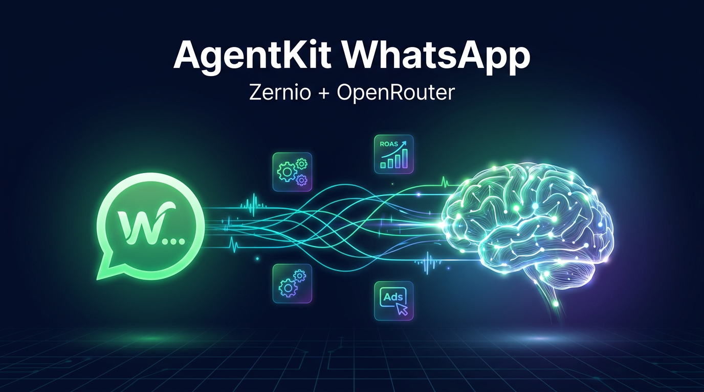

<p align="center">
  
</p>

# WhatsApp Agentreply — Zernio + OpenRouter

Conecta uno o más números de **WhatsApp** (vía [Zernio](https://zernio.com)) con un cerebro de
**IA** (vía [OpenRouter](https://openrouter.ai)) para que **respondan solos**, con personalidad
propia por número. Incluye atribución de **anuncios Click-to-WhatsApp de Meta + ROAS** (opcional).

Pensado para correrse **con un agente** (Claude Code): respondes unas preguntas con tus cuentas y
queda listo. No necesitas saber programar.

---

## ⚡ Empezar en 3 pasos

> Necesitas un **agente de terminal** (Claude Code, Gemini CLI, Codex CLI o Cursor) y tus claves de
> [OpenRouter](https://openrouter.ai/keys) y [Zernio](https://zernio.com). *(ChatGPT/Gemini web no
> sirven para esto: no pueden ejecutar en tu PC.)*

```bash
# 1. Clona el repo
git clone https://github.com/Robertheboys/whatsapp-agentreply.git
cd whatsapp-agentreply
```

```bash
# 2. Abre tu agente en la carpeta (ejemplo con Claude Code)
claude
```

**3.** Dile: **"Configura este repositorio para mí"** (o `/setup-agente` en Claude Code).
El agente te entrevista, pega tus claves en `.env`, prueba el bot y te guía el deploy. ✅

---

## ¿Qué hace?

- 🤖 **Auto-responde** los WhatsApp de tus negocios con IA, 24/7.
- 🏢 **Multi-negocio**: cada número usa su propia personalidad y conocimiento.
- 🧠 **OpenRouter**: elige cualquier modelo (GPT, Claude, etc.) por negocio.
- 📊 **Anuncios + ROAS (opcional)**: sabe de qué anuncio de Meta viene cada chat y mide retorno.
- 🔒 **Seguro**: verifica la firma del webhook (HMAC), no guarda secretos en el repo.
- 🚀 **Deploy**: Docker o Coolify, en tu propio servidor.

## Requisitos

- **Python 3.11+**
- **Claude Code** (opcional, para el setup guiado): `npm install -g @anthropic-ai/claude-code`
- Cuenta de **Zernio** con tu(s) número(s) de WhatsApp conectados.
- Cuenta de **OpenRouter** (API key).
- *(Opcional)* Token de **Meta** con scope `ads_read` si quieres anuncios + ROAS.

## Inicio rápido (con agente)

La forma más simple: clona, abre tu agente de terminal favorito y dile que configure el repo.

```bash
git clone <tu-fork-de-este-repo>.git
cd whatsapp-agentreply
```

**Con Claude Code** (lo más directo):
```bash
claude
/setup-agente        # te entrevista y deja todo listo
```

**Con Gemini CLI, Codex CLI, Cursor u otro agente de terminal:** ábrelo en la carpeta y escríbele:

> *"Configura este repositorio para mí."*

El agente leerá las instrucciones de onboarding (`CLAUDE.md` / `AGENTS.md` / `GEMINI.md`, según el
agente) y te guiará paso a paso. Todos apuntan al mismo proceso.

> ⚠️ Esto funciona con **agentes de terminal** (que pueden ejecutar comandos en tu PC).
> **ChatGPT o Gemini web** no pueden configurarlo por ti: solo te dan los pasos para hacerlo a mano.

## Inicio rápido (manual)

```bash
pip install -r requirements.txt
cp .env.example .env                          # llena tus claves
cp config/businesses.example.yaml config/businesses.yaml   # pon tus negocios

# Prueba sin WhatsApp (chat en la terminal):
python tests/test_local.py

# Levanta el servidor:
uvicorn agent.main:app --reload --port 8000
```

> **En Windows:** usa `python` en vez de `python3`, y `copy` en vez de `cp`. Si no tienes `bash`
> para `start.sh`, abre Claude Code y usa `/setup-agente`: el agente hace todo el setup por ti
> (incluido generar `ZERNIO_WEBHOOK_SECRET` y `REPORT_TOKEN`).

## Configuración

### `.env` (claves — nunca se sube)
| Variable | Para qué |
|---|---|
| `OPENROUTER_API_KEY` | Cerebro de IA (https://openrouter.ai/keys) |
| `ZERNIO_API_KEY` | API de Zernio (dashboard → API Keys) |
| `ZERNIO_WEBHOOK_SECRET` | Valida la firma del webhook (genera uno: `openssl rand -hex 32`) |
| `REPORT_TOKEN` | Protege `/reports` y `/sale` |
| `ENABLE_ADS` | `true` para activar anuncios + ROAS (usa la Ads API de Zernio) |
| `META_ACCESS_TOKEN` | **Opcional**. Respaldo directo a Meta; vacío = solo Zernio |
| `DATABASE_URL` | SQLite por defecto |

### `config/businesses.yaml` (un bloque por número — nunca se sube)
Copia `config/businesses.example.yaml`. El campo clave es `zernio_account_id`: es el ID de la
cuenta del número en Zernio, y sirve para enrutar cada mensaje al negocio correcto. Pon los
archivos de conocimiento de cada negocio en `config/knowledge/<carpeta>/`.

## ¿Cómo funciona?

```
Cliente WhatsApp → Zernio → webhook message.received → POST /webhook
                                                          │
                              1. verifica firma HMAC + responde 2xx YA
                              2. enruta por account.id → negocio correcto
                              3. (en segundo plano) OpenRouter genera respuesta
                              4. responde por la API de Zernio
                              5. (si ENABLE_ADS) captura anuncio + ROAS
```

El procesamiento de IA va **en segundo plano** porque Zernio exige respuesta del webhook en
menos de 5 segundos (si no, reintenta y tras varios fallos desactiva el webhook).

## Anuncios de Meta + ROAS (opcional)

Con `ENABLE_ADS=true` (**solo necesitas `ZERNIO_API_KEY`** — conecta tu cuenta de Meta Ads a
Zernio en la sección *Ads* del dashboard; **no hace falta un token de Meta aparte**):
1. Cada conversación que llega por un anuncio **Click-to-WhatsApp** guarda su origen
   (`ctwa_source_id`, titular, etc.) — Zernio lo entrega automáticamente.
2. Se enriquece con el nombre de anuncio/campaña y el gasto vía la **Ads API de Zernio**
   (`GET /v1/ads/{adId}`). Opcional: si defines `META_ACCESS_TOKEN`, se usa Meta Graph como respaldo.
3. Se reporta `LeadSubmitted` a Meta (vía Zernio); y `Purchase` cuando registras una venta:
   ```bash
   curl -X POST https://<tu-dominio>/sale \
     -H "Authorization: Bearer $REPORT_TOKEN" \
     -H "Content-Type: application/json" \
     -d '{"conversation_id":"conv_abc","amount":49.0,"account_id":"acct_xxx"}'
   ```
4. Reporte de ROAS por anuncio:
   ```bash
   curl "https://<tu-dominio>/reports/roas?dias=30&ad_account_id=act_123" \
     -H "Authorization: Bearer $REPORT_TOKEN"
   ```

> Antes de enviar conversiones, provisiona el dataset CTWA **una vez por número**:
> ```bash
> python -m agent.zernio provision <account_id_1> <account_id_2>
> ```
> (El comando `/setup-agente` también te guía en esto.)

## Deploy

### 🟢 Lo más fácil: deploy con un agente (MCP de Railway)

[Railway](https://railway.com) tiene un **servidor MCP** que deja que tu agente de IA (Claude Code,
Cursor, etc.) cree el proyecto, cargue las variables y despliegue **por ti**, hablando por chat.
Es el camino recomendado para usuarios sin experiencia técnica.

1. Sube el repo a tu propio GitHub (sin `.env` ni `config/businesses.yaml` — ya están en `.gitignore`).
2. Conecta el MCP de Railway a tu agente (una sola vez):
   ```bash
   claude mcp add railway --transport http https://mcp.railway.com
   ```
   La primera vez Railway te pedirá **autenticarte con OAuth** en el navegador (normal y seguro).
3. Pídele a tu agente: *"despliega este repo en Railway"*. El agente, vía MCP:
   - crea el proyecto y el servicio desde tu repo de GitHub,
   - carga las variables de tu `.env` (OpenRouter, Zernio, etc.),
   - despliega y te devuelve la **URL pública con HTTPS**.
4. **Tú** pegas esa URL en **Zernio → Webhooks** (`https://<url-railway>/webhook`), con tu
   `ZERNIO_WEBHOOK_SECRET` y el evento `message.received`. (Esto lo haces tú porque es tu cuenta de Zernio.)

> Notas: Railway cuesta ~$5/mes tras el crédito gratis inicial. Activa un **volumen** en `/app/data`
> para que la memoria SQLite no se borre entre redeploys. Si tu agente no soporta MCP (p. ej. ChatGPT
> web), sigue los mismos pasos a mano en el panel de Railway — es un formulario de variables.

### Coolify (en tu VPS)
1. Sube el repo a GitHub (sin `.env` ni `config/businesses.yaml` — ya están en `.gitignore`).
2. Coolify → **New Resource** → desde tu repo → build por **Dockerfile**.
3. Asigna un dominio con **HTTPS automático**.
4. Carga las variables de `.env` en el panel. Monta un **volumen persistente** en `/app/data`.
5. En **Zernio → Webhooks**, crea un webhook a `https://<tu-dominio>/webhook`, con el
   `ZERNIO_WEBHOOK_SECRET` y el evento `message.received`.

### Docker (cualquier VPS)
```bash
docker compose up -d --build
```
Ponlo detrás de un reverse proxy con HTTPS (Caddy/Traefik/Nginx) y da de alta el webhook en Zernio.

## Preguntas frecuentes

**¿Necesito plantillas de WhatsApp?** No para responder: el bot siempre contesta dentro de la
ventana de 24h. Las plantillas solo hacen falta para iniciar conversaciones en frío.

**¿Puedo conectar más de 2 números?** Sí, agrega un bloque por número en `config/businesses.yaml`.

**¿Qué modelos de IA puedo usar?** Cualquiera de [OpenRouter](https://openrouter.ai/models),
configurable por negocio (`modelo:` en el YAML). Por nivel:
- 💚 **Económicos** (centavos por miles de mensajes): `openai/gpt-4o-mini`, `google/gemini-flash-1.5`,
  `deepseek/deepseek-chat`, `anthropic/claude-3.5-haiku`.
- 💛 **Equilibrados**: `openai/gpt-4o`, `anthropic/claude-3.5-sonnet`, `google/gemini-pro-1.5`.
- ❤️ **Premium**: `anthropic/claude-3.7-sonnet`, `openai/o1`.

El `/setup-agente` te pregunta cuál quieres. Por defecto usa el económico `openai/gpt-4o-mini`.

**¿El bot puede enviar imágenes?** Sí, imágenes y imágenes con texto. Defines una galería por
negocio en `config/businesses.yaml` (bloque `media:` con `clave → {url, desc}`, URLs públicas) y el
bot las envía cuando corresponde escribiendo `[IMG:clave]` en su respuesta. Ejemplo: el cliente pide
el menú → el bot manda la foto con un texto. Solo envía las imágenes que configuraste (no inventa URLs).

**Para los anuncios, ¿qué es más fácil: Zernio o un token de Meta?** Zernio, sin comparación.
Solo conectas tu cuenta de Meta Ads a Zernio (1 clic con OAuth en el dashboard) y reutilizas la
misma `ZERNIO_API_KEY` — sin crear una app de Meta, sin generar tokens que caducan, sin manejar
scopes. El `META_ACCESS_TOKEN` directo es solo un respaldo opcional.

**¿Y si Zernio me limita las conexiones (ej. 2) y ya las usé con mis 2 WhatsApp?** No es problema
para lo esencial: **capturar de qué anuncio viene cada chat y enviar las conversiones a Meta
(LeadSubmitted/Purchase) NO consumen una conexión extra** — usan el token de tu propio número de
WhatsApp. Lo único que pide una conexión adicional (o un `META_ACCESS_TOKEN`) es ver el **nombre
del anuncio y el gasto dentro de esta app**. Si te quedaste sin cupo, tienes 2 salidas: usar un
token de Meta directo (independiente del límite de Zernio), o simplemente leer el **ROAS en el
Administrador de Anuncios de Meta**, al que igual le llegan tus conversiones. El comando
`/setup-agente` te deja elegir entre estos modos.

## Licencia

MIT — ver [LICENSE](LICENSE). Construido sobre la idea del kit `whatsapp-agentkit`.
